# Nidhi Vault - Technical Design Flowcharts

This document contains all flowcharts and diagrams referenced in the Technical Design Document.

## Table of Contents

1. [System Architecture Overview](#1-system-architecture-overview)
2. [User Authentication Flow](#2-user-authentication-flow)
3. [User Registration Flow](#3-user-registration-flow)
4. [Admin User Creation Flow](#4-admin-user-creation-flow)
5. [Document Upload Flow](#5-document-upload-flow)
6. [Document Download & Watermarking Flow](#6-document-download--watermarking-flow)
7. [Document Access Control Flow](#7-document-access-control-flow)
8. [NDA Signature Workflow](#8-nda-signature-workflow)
9. [Vault Permission Check Flow](#9-vault-permission-check-flow)
10. [File Compression & Chunking Flow](#10-file-compression--chunking-flow)
11. [Database Query with RLS Flow](#11-database-query-with-rls-flow)
12. [Activity Logging Flow](#12-activity-logging-flow)
13. [Role-Based Access Control Decision Tree](#13-role-based-access-control-decision-tree)

---

## 1. System Architecture Overview

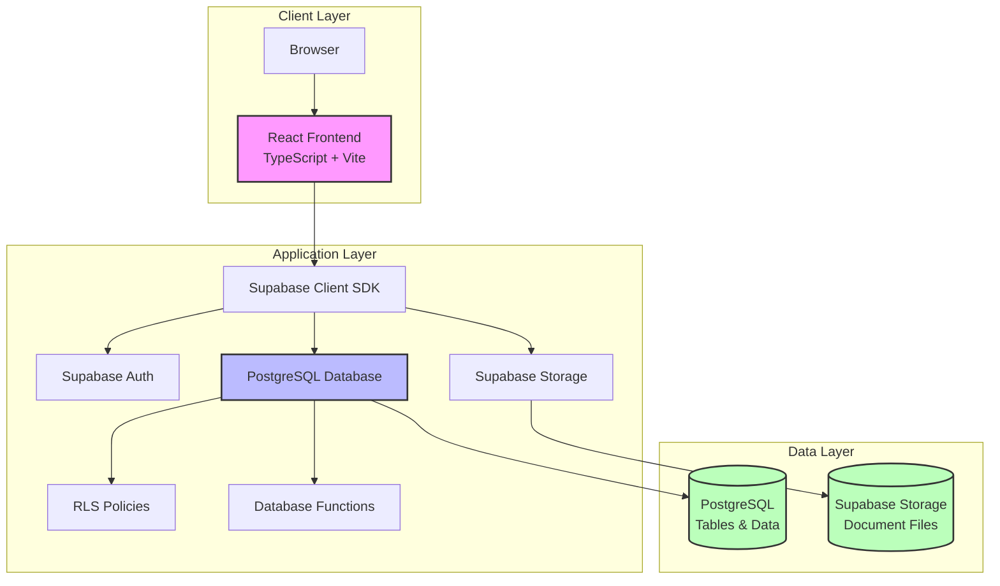

---

## 2. User Authentication Flow

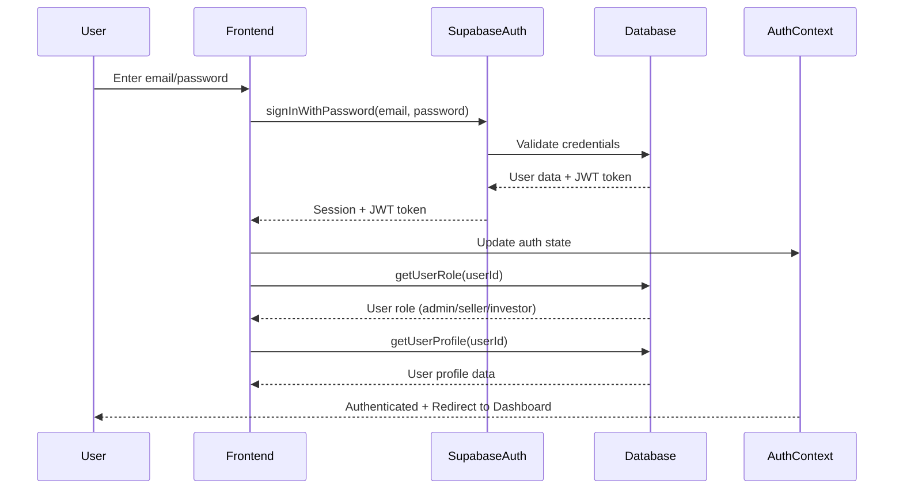

---

## 3. User Registration Flow

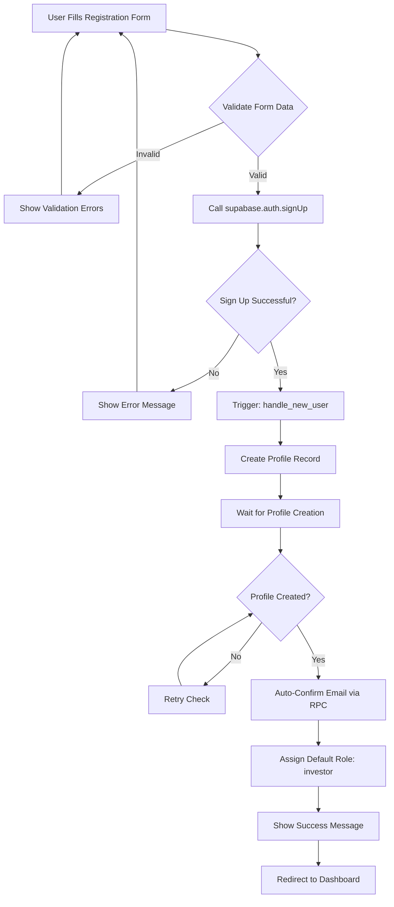

---

## 4. Admin User Creation Flow

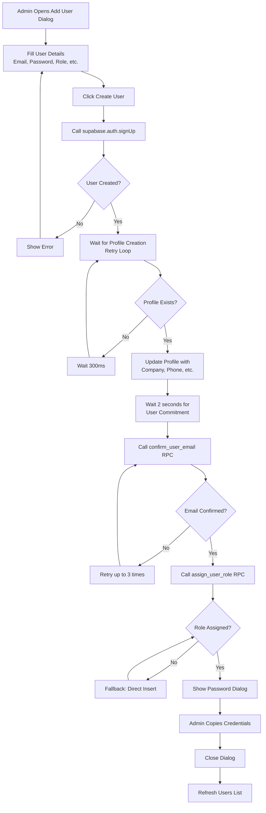

---

## 5. Document Upload Flow

```mermaid
flowchart TD
    A[User Selects File(s)] --> B[Initialize Upload Progress]
    B --> C{File Size > 50MB?}
    C -->|No| D[Upload to Supabase Storage]
    C -->|Yes| E[Attempt Compression]
    E --> F{Compression Successful<br/>& Size < 50MB?}
    F -->|Yes| D
    F -->|No| G[Split File into Chunks<br/>45MB each]
    G --> H[Upload Each Chunk]
    H --> I{All Chunks Uploaded?}
    I -->|No| H
    I -->|Yes| J[Create Document Record]
    D --> J
    J --> K[Log Upload Activity]
    K --> L[Update Progress: Success]
    L --> M[Show Success Message]
    
    style E fill:#ffeb3b
    style G fill:#ff9800
    style D fill:#4caf50
    style J fill:#2196f3
```

---

## 6. Document Download & Watermarking Flow

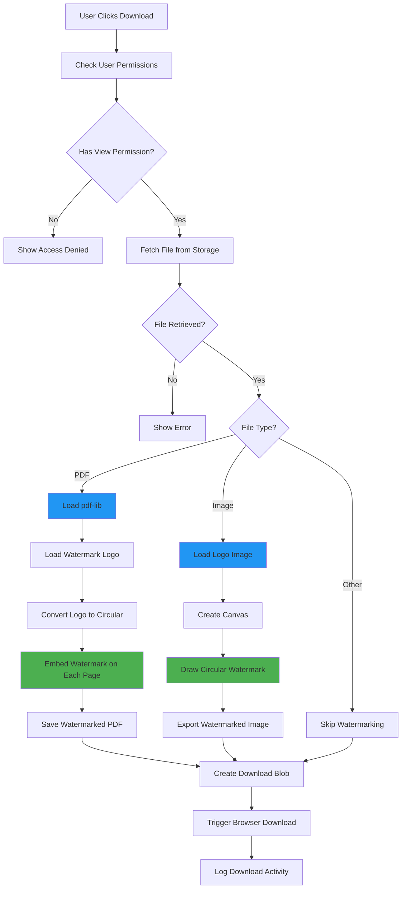

---

## 7. Document Access Control Flow

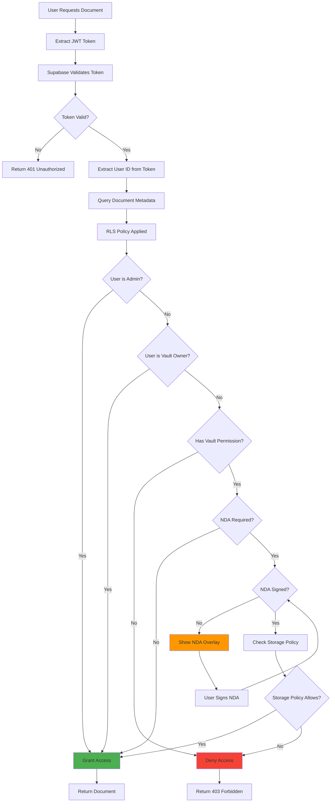

---

## 8. NDA Signature Workflow

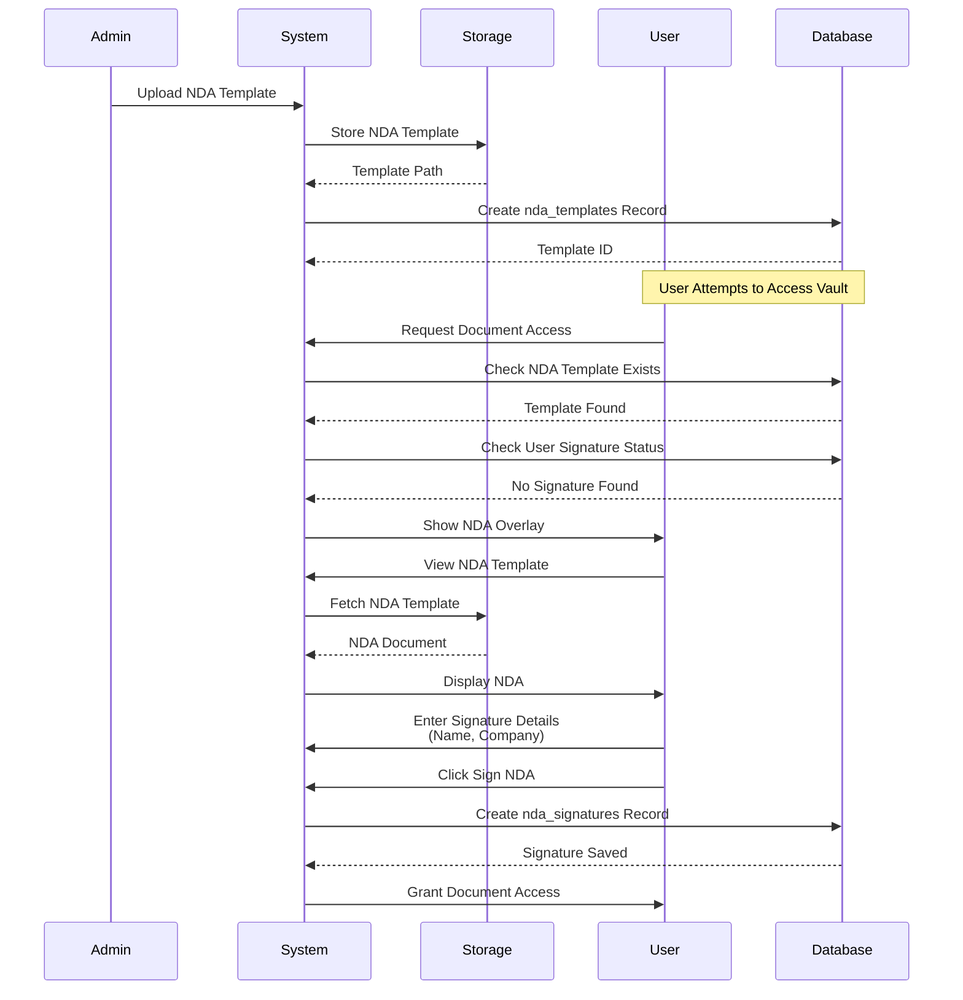

---

## 9. Vault Permission Check Flow

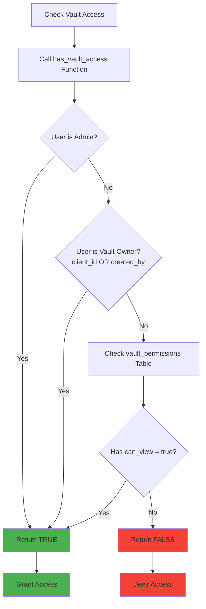

---

## 10. File Compression & Chunking Flow

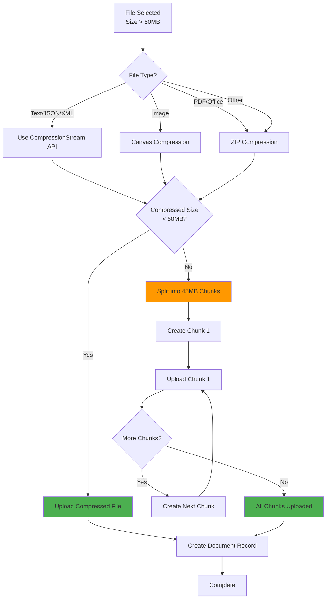

---

## 11. Database Query with RLS Flow

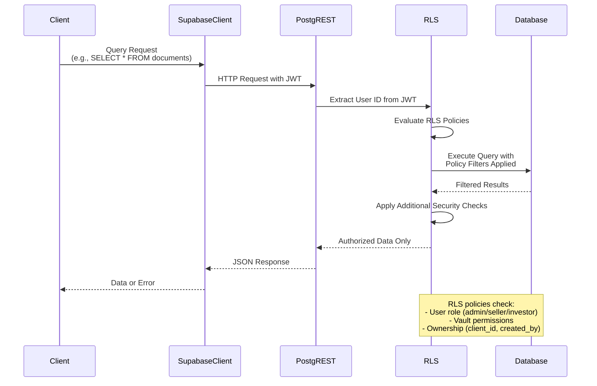

---

## 12. Activity Logging Flow

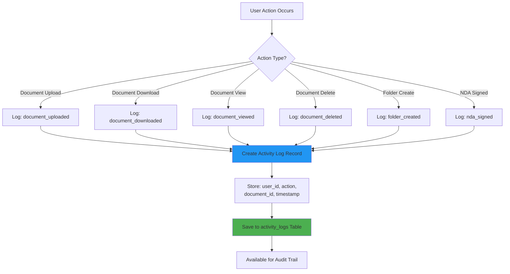

---

## 13. Role-Based Access Control Decision Tree

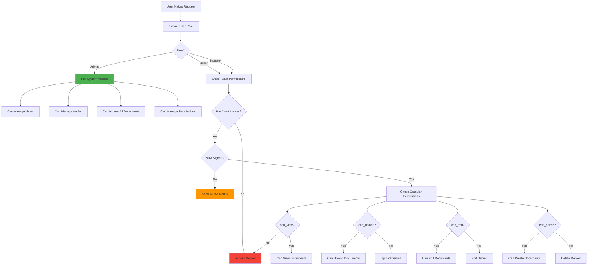

---

## 14. Storage Policy Evaluation Flow

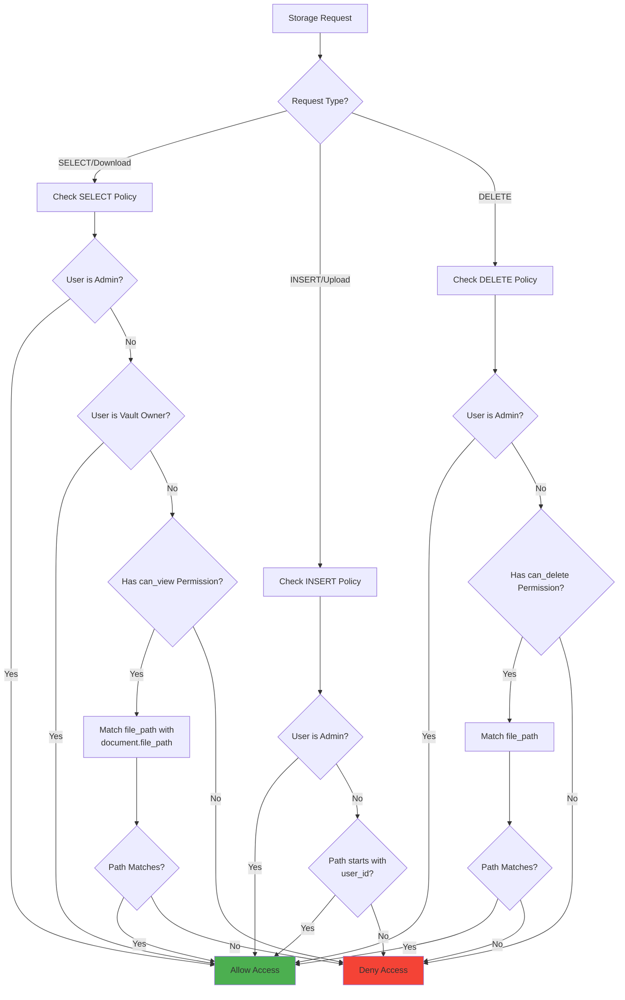

---

## 15. Complete User Journey Flow

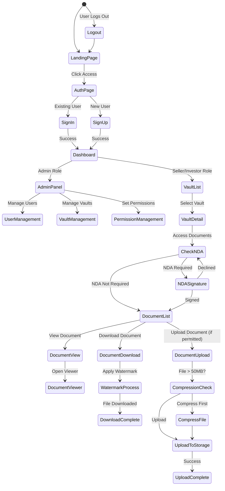

---

## 16. Database Schema Relationships

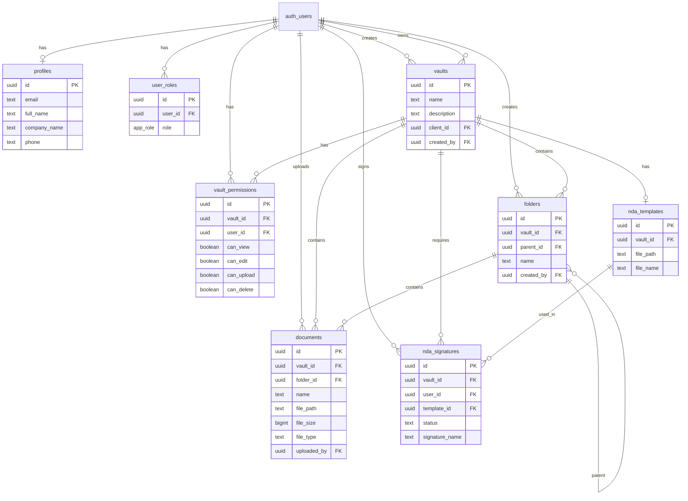

---

## Notes on Flowchart Usage

### Mermaid Support
These flowcharts use Mermaid syntax, which is supported by:
- GitHub/GitLab markdown viewers
- VS Code with Mermaid extensions
- Many documentation platforms
- Online Mermaid editors (mermaid.live)

### Rendering
To view these flowcharts:
1. **GitHub/GitLab**: They render automatically in markdown files
2. **VS Code**: Install "Markdown Preview Mermaid Support" extension
3. **Online**: Copy code blocks to https://mermaid.live
4. **Documentation Tools**: Most modern tools support Mermaid

### Integration
These flowcharts can be:
- Referenced in the Technical Design Document
- Included in developer documentation
- Used in presentations and training materials
- Embedded in project wikis

---

**Document Version**: 1.0  
**Last Updated**: 2024  
**Maintained By**: Senior Software Engineering Team
